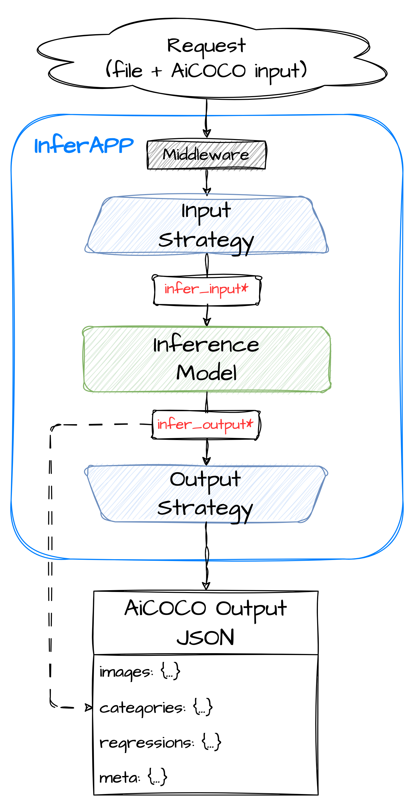

# FLaVor Inference Service Overview

<p align="center">
    
</p>

Welcome to the FLaVor Inference Service! This service streamlines the application of machine learning models by offering a user-friendly interface that encapsulates intricate inference functions. It's crafted to seamlessly handle requests with various input formats, ensuring that the inference outputs adhere to the structured AiCOCO format, a standard developed by Taiwan AILabs.

## How It Works

Using the FLaVor inference service is straightforward. Users simply send a POST request to the `/invocations` endpoint, including form data comprising an image file and a corresponding JSON file following the AiCOCO format. The service then progresses through the following stages to process the request effectively:

- **Input Strategy**: Raw input data undergoes meticulous preparation, ensuring it conforms to the required format for the Inference Model.
- **Inference Model**: The provided machine learning model is invoked on the processed data. It takes `infer_input` as input and produces `infer_output` as a result. For detailed information regarding the input (`infer_input`) and output (`infer_output`) structures of the Inference Model, please consult [Standard input and output structure](./docs/input_output_structure.md).
- **Output Strategy**: The results yielded by the Inference Model are interpreted and formatted to adhere to the AiCOCO format standards.

## `/invocations` API Endpoint

- **Method**: POST
- **URL**: `/invocations`
- **Content-Type**: multipart/form-data
- **Body**: The request body should be formatted as multipart/form-data, allowing inclusion of multiple files and text fields.

  - **Required:**
    - `files`: The image for inference.
    - `data`: A JSON file with an `images` field in AiCOCO format, referencing the input image.
    - `metadata` (optional): Any additional information related to the files.

**Example**:

```python
import requests
import json

# Prepare data and files for the request
data = {
    "id": "0",
    "index": 0,
    "file_name": "0.dcm",
    "category_ids": None,
    "regressions": None
}

files = [("files", (f"images_image.jpg", open("image.jpg", "rb")))]
json_file["images"] = json.dumps(data)

# Send the POST request
response = requests.post(
    "http://0.0.0.0:9000/invocations",
    data=json_file,
    files=files,
)
```

Please refer to [`send_request.py`](send_request.py) for more detail.

## Getting Started

To begin using the FLaVor Inference Service, follow these steps:

### Step 1: Define Your Inference Model

Start by defining your custom inference model by subclassing the `BaseInferenceModel`. This serves as a template for implementing inference functionality tailored to your machine learning or deep learning model.

Let's walk through the implementation by an example of the segmentation task. (Complete implementation in [Segmentation task example](./docs/segmentation_example.md))

```python
from flavor.serve.models import BaseInferenceModel
from flavor.serve.models import InferSegmentationOutput

class SegmentationInferenceModel(BaseInferenceModel):
    ## Implement methods to define model-specific behavior
    ...

```

### Step 2: Customize Model-specific Behavior

Override the abstract methods in your custom inference model to define the specific behavior of your model:

- `define_inference_network()`: Define the inference network or model. Return a callable object or a network instance.
- `define_categories()`: Define inference categories and return `None` if no categories. In segmentation task, here we define segmentation categories with names and display settings.
- `define_regressions()`: Define inference regressions and return `None` if no regressions. In segmentation task, here we simply return `None`.
- `preprocess()`: Implement data preprocessing logic for the inference process.
- `postprocess()`: Implement any additional postprocessing steps for model output.

### Step 3: Run the Inference Service

Instantiate the `InferAPP` class from the FLaVor Inference Service, providing your `SegmentationInferenceModel`, input strategy, and output strategy. Then, run the application.

```python
from flavor.serve.apps import InferAPP
from flavor.serve.strategies import AiCOCOInputStrategy, AiCOCOSegmentationOutputStrategy

app = InferAPP(
    infer_function=SegmentationInferenceModel(output_data_model=InferSegmentationOutput),
    input_strategy=AiCOCOInputStrategy,
    output_strategy=AiCOCOSegmentationOutputStrategy,
)
app.run(port=int(os.getenv("PORT", 9000)))

```

### Step 4: Send Inference Requests

Once the FLaVor Inference Service is running, send POST requests to the /invocations endpoint with image data and associated metadata formatted in AiCOCO format to perform segmentation inference.

By following these steps, you can seamlessly integrate your segmentation model with the FLaVor Inference Service and leverage its user-friendly interface for simplified segmentation tasks.

### More Examples for Various Tasks

Please visit following instruction pages:

- [Classification task example](./docs/classification_example.md)
- [Detection task example](./docs/detection_example.md)
- [Regression task example](./docs/regression_example.md)
- [Segmentation task example](./docs/segmentation_example.md)

## Exploring `InferAPP`

`InferAPP` serves as the central component of the FLaVor Inference Service, facilitating seamless interaction between users and machine learning models. Let's delve deeper into its functionalities and how to leverage it effectively.

To harness the power of `InferAPP`, developers need to provide the following essential components:

- `infer_function`: Developers can specify their custom inference function, allowing `InferAPP` to invoke the model and process its output seamlessly. Refer to [Standard input and output structure](./docs/input_output_structure.md) for more detail.

- `input_strategy`: With the flexibility to define input strategies, developers can convert incoming API requests into the standardized AiCOCO format. The standardized `AiCOCOInputStrategy` ensures consistency and compatibility with the AiCOCO format. Both the input and output of `input_strategy` must adhere to the AiCOCO format with the `images` field.

- `output_strategy`: `InferAPP` supports various output strategies tailored to different tasks, including classification, detection, regression, and segmentation. Developers can choose the appropriate output strategy to format the model's output into the AiCOCO-compatible structure. Currently four standard output strategy are available: `AiCOCOClassificationOutputStrategy`, `AiCOCODetectionOutputStrategy`, `AiCOCORegressionOutputStrategy`, and `AiCOCOSegmentationOutputStrategy`. Refer to [Standard input and output structure](./docs/input_output_structure.md) for more detail.

## Other Things You Might Want to Know

- [AiCOCO format specification](./docs/AiCOCO_spec.md)
- [Standard input and output structure](./docs/input_output_structure.md)
- [Visualize your inference output with Gradio](./docs/gradio_example.md)
