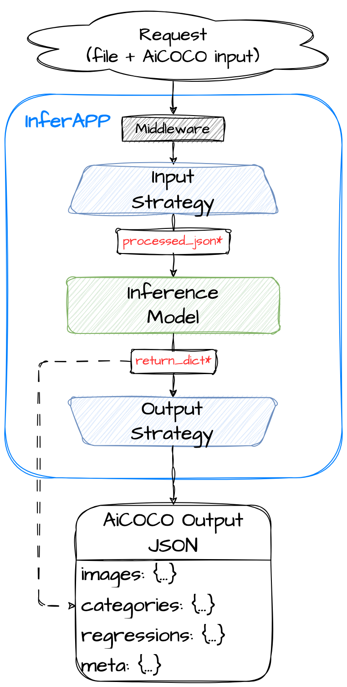

# FLaVor Inference Service Overview



Welcome to the FLaVor Inference Service! This service simplifies the application of machine learning models by providing a user-friendly interface that encapsulates complex inference functions. It's designed to handle request with various input data formats and the service outputs results in the structured AiCOCO format, a standard development by Taiwan AILabs.

## How It Works

When using the FLaVor inference service, users send a POST request to the `/invocations` endpoint. This request includes form data containing an image file and a corresponding JSON file following the AiCOCO format. The service then processes the request through the following stages:

* Input Strategy: Raw input data is meticulously prepared into a format suitable for the Inference Model.
* Inference Model: The provided machine learning model is executed on the processed data. For more information about the input (`processed_json`) and output (`return_dict`) of Inference Model, please refer to [Standard input and output structure](input_output_structure.md).
* Output Strategy: The results generated by the Inference Model are interpreted and formatted to the AiCOCO format.

## `/invocations` API endpoint

**Method**: POST

**URL**: `/invocations`

**Content-Type**: multipart/form-data

**Body**: The request body should be formatted as multipart/form-data. You can include multiple files and text fields.

* Required:
  * files: The image for inference.
  * data: A JSON file with `images` field in AiCOCO format referring to the input image.
  * metadata (optional): Any additional information related to the files.

**Example**:

```python
recv = requests.post(
    "http://0.0.0.0:9999/invocations",
    data=data,
    files=files,
)
```

Please refer to [`send_request.py`](send_request.py) for more detail.

## Getting started

### Example of a segmentation task (PyTorch)

```python
from flavor.serve.apps import InferAPP
from flavor.serve.strategies import AiCOCOInputStrategy, AiCOCOSegmentationOutputStrategy

# Define the infer function for your model
def infer(x, **kwargs):

    # Your model & inference code
    model_out = model(x)

    # Please return your output as defined in README
    result = {
        "sorted_images": [
            {"id": "TZsN5Td8LunFEdL8o8334", "file_name": "slice0.dcm", "index": 0, ...},
            {"id": "tF410qthYoQ5t7qnK2RcR", "file_name": "slice1.dcm", "index": 1, ...},
            ...
        ],
        "categories": {
            0: {"name": "Background", "supercategory_name": "Tumor", "display": False},
            1: {"name": "Lesion", "supercategory_name": "Tumor", "display": True},
            ...
        },
        "model_out": model_out,
    }

    return result

# Wrap the infer function with input and optional output strategies
app = InferAPP(infer_function=infer,
               input_strategy=AiCOCOInputStrategy,
               output_strategy=AiCOCOSegmentationOutputStrategy)

# Start the application
app.run(port=9000)
```

### `InferAPP` Overview

`InferAPP` streamlines the use of inference models by encapsulating the inference functions and input/output strategies tailored to the processing and production of AiCOCO-formatted data. It serves as the backbone of the FLaVor Inference Service, orchestrating the flow of data between the user and the machine learning model.

#### Usage

To utilize `InferAPP`, developers need to specify the following arguments:

* `infer_function`: The inference function of the model. It takes a JSON object with an `images` key following the AiCOCO format as input and returns the inference result in a specified format that the `output_strategy` can access. Refer to [Standard input and output structure](input_output_structure.md) for more detail.

* `input_strategy`: This function converts the API input into the desired format. The standard input strategy function can be found under `AiCOCOInputStrategy`. Both the input and output of `input_strategy` must adhere to the AiCOCO format with the `images` key.

* `output_strategy`: This function converts the model output into an AiCOCO-compatible format. Depending on the task, developers can choose from four standard output strategy functions: `AiCOCOClassificationOutputStrategy`, `AiCOCODetectionOutputStrategy`, `AiCOCORegressionOutputStrategy`, and `AiCOCOSegmentationOutputStrategy`. These strategies ensure the output conforms to the specified format. Refer to [Standard input and output structure](input_output_structure.md) for more detail. We also provide visualization tool for the inference result with Gradio interface. See [GradioStrategy](./gradio_example/README.md).

For more examples, please visit following folders:

* [Classification task example](./classification_example/README.md)
* [Detection task example](./detection_example/README.md)
* [Regression task example](./regression_example/README.md)
* [Segmentation task example](./segmentation_example/README.md)

## Things you might want to know

* [AiCOCO format specification](AiCOCO_spec.md)
* [Standard input and output structure](input_output_structure.md)
* [Visualize your inference output with Gradio Strategy](./gradio_example/README.md)
