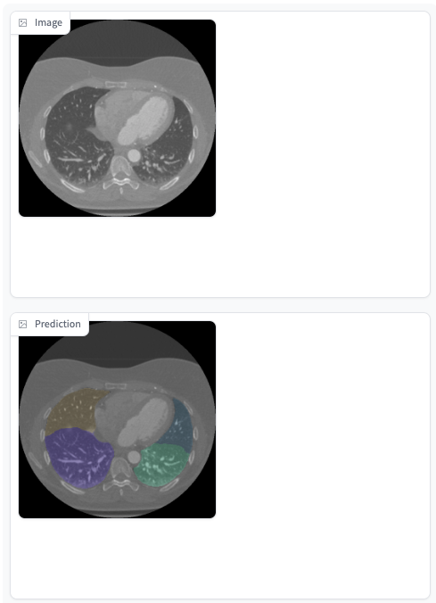

# Visualize Your Inference Output with Gradio Strategy



To quickly evaluate how well the model performs, we provide a visualization tool using [Gradio](https://github.com/gradio-app/gradio), an open-source Python package that allows for the fast deployment of machine learning models with a GUI. Currently, we support the following tasks:

* `GradioSegmentationStrategy`
* `GradioDetectionStrategy`

## Prerequisite

Please follow the instructions in [segmentation example](../segmentation_example/README.md).

## Getting started

Let's demonstrate Gradio Strategy with [segmentation example](../segmentation_example/README.md). We'll adopt all the codes in `main.py` and additionally return `data` as one of the elements in the returning dictionary.

```python
return_dict = {
    "sorted_images": [{"id": uid, "file_name": file_name, "index": index, ...}, ...],
    "categories": {class_id: {"name": category_name, "supercategory_name": supercategory_name, display: True, ...}, ...},
    "model_out": model_out, # 3d/4d NumPy array with segmentation predictions.
    "data": data # Original input data. Must be specified for Gradio
}
```

Then, use `GradioInferAPP` by specifying `GradioInputStrategy` for `input_strategy` and `GradioSegmentationStrategy` for `output_strategy` as follows:

```python
app = GradioInferAPP(
    infer_function=Inferer(),
    input_strategy=GradioInputStrategy,
    output_strategy=GradioSegmentationStrategy,
)
```

By using `GradioInputStrategy`, you won't need additional AiCOCO input anymore.

Initiate the service as given in the examples, and go to <http://localhost:9000/>. You are all set! Play around with the Gradio GUI using your inference model.
