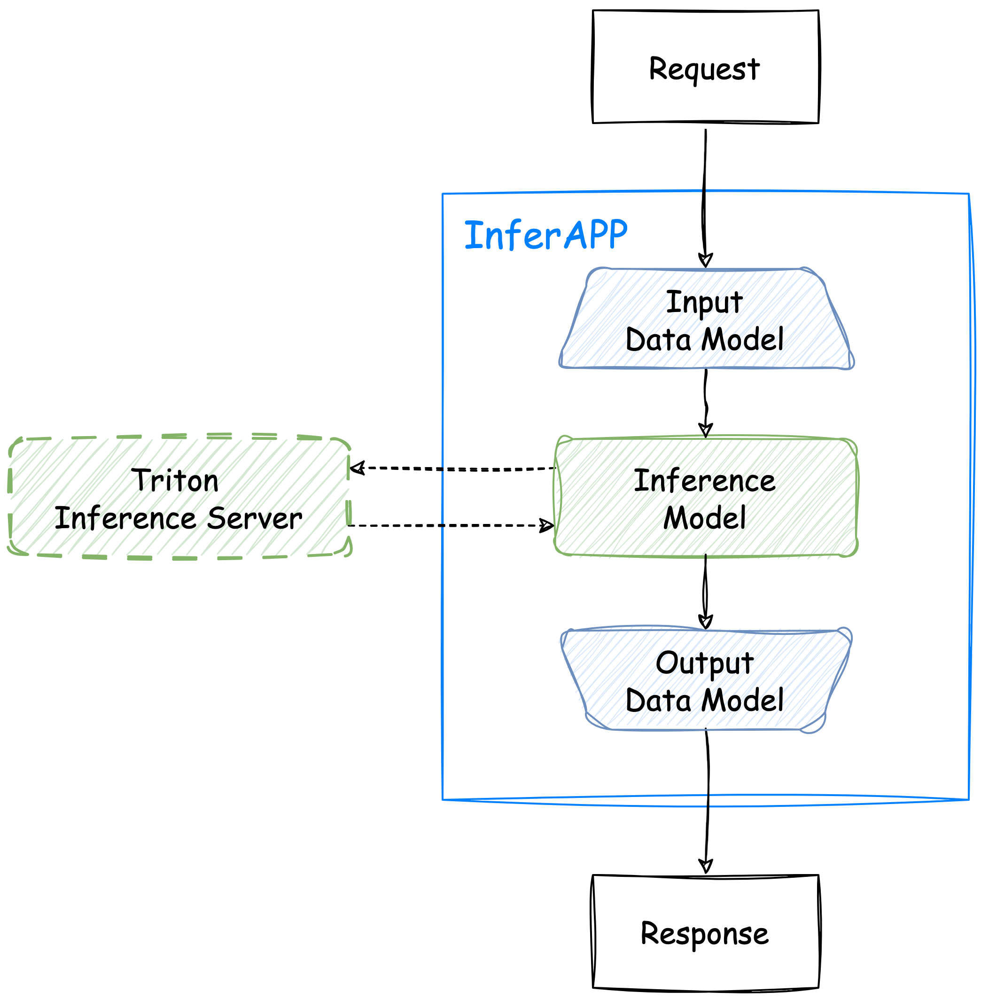

# FLaVor Inference Service Overview

<p align="left">
    
</p>

Welcome to the FLaVor Inference Service! This service simplifies the deployment of machine learning models by providing a user-friendly interface that encapsulates complex inference functions. It is designed to handle requests with various input formats seamlessly, ensuring that the inference outputs adhere to a specific format, e.g., AiCOCO format, a standard developed by Taiwan AILabs.

## How Does It Work

To initiate the service, simply instantiate `InferAPP` built upon a customized inference model. For example:

```python
app = InferAPP(
    infer_function=YourInferenceModel(),
    input_data_model=YourInputDataModel,
    output_data_model=YourOutputDataModel,
)
app.run(port=int(os.getenv("PORT", 9111)))
```

By sending a POST request to the `/invocations` endpoint of `InferAPP`, it will respond in a format defined in `YourOutputDataModel`.

### `/invocations` API Endpoint

- **Method**: POST
- **URL**: `/invocations`
- **Content-Type**: multipart/form-data
- **Body**: The request body should be formatted as multipart/form-data, allowing inclusion of multiple files and text fields.

  - **Required:**
    - `files`: The images for inference.
    - `data`: A JSON file with an `images` field in AiCOCO format, referencing the input image.
    - `metadata` (optional): Any additional information related to the files.

**Example**:

```python
import requests
import json

# Prepare data and files for the request
data = {
    "id": "0",
    "index": 0,
    "file_name": "0.dcm",
    "category_ids": None,
    "regressions": None
}

img_files = [("files", ("PATH_0.dcm", open("0.dcm", "rb")))]
json_data["images"] = json.dumps(data)

# Send the POST request
response = requests.post(
    "http://0.0.0.0:9111/invocations",
    data=json_data,
    files=img_files,
)
```

Please refer to [`send_request.py`](./send_request.py) for more detail.

## Getting Started

To begin with the FLaVor Inference Service, follow these steps:

### Step 1: Define Your Inference Model

Start by defining your custom inference model by inheriting the `BaseInferenceModel` class. This serves as a template for implementing inference functionality tailored to your machine learning model.

Here's an example of a segmentation inference model. For more detail in the implementation, refer to the [Segmentation task example](./seg_example.ipynb).

```python
from flavor.serve.models import BaseAiCOCOImageInferenceModel

class SegmentationInferenceModel(BaseAiCOCOImageInferenceModel):
    ## Implement methods to define model-specific behavior
    ...

```

### Step 2: Customize Model-specific Behavior

Firstly, override the following abstract methods in your customized inference model.

For constructor, i.e., `__init__()`:

- `define_inference_network()`: Define the inference network or model and return a callable object or a network instance.
- `set_categories()`: Set inference categories and return `None` if no categories. For example, a segmentation output would contain `c` channels. By specifying in `set_categories()`, we show the exact meaning of each channel.
- `set_regressions()`: Set inference regressions and return `None` if no regressions. In segmentation task, here we simply return `None`.

For inference workflow, i.e., `__call__()`:

<p align="left">
    
</p>

The above image illustrates the workflow of inference model. We will go through the implementation step-by-step.

- `data_reader()`: (Abstract method) Read input data to numpy array or torch tensor.
- `preprocess()`: Implement data transformation for the inference process.
- `inference()`: Implement forward operation.
- `postprocess()`: Implement any additional postprocessing steps for model output.
- `output_formatter()`: (Abstract method) Format the network output to a structured response. Currently four standard output strategy are available: `AiCOCOClassificationOutputStrategy`, `AiCOCODetectionOutputStrategy`, `AiCOCORegressionOutputStrategy`, and `AiCOCOSegmentationOutputStrategy`. See [Standard input and output structure](./docs/input_output_structure.md). In segmentation task, we choose `AiCOCOSegmentationOutputStrategy` as the formatter.

Next, you can override the following non-abstract methods if necessary:

### Step 3: Run the Inference Service

To run the FLaVor Inference Service, instantiate the `InferAPP` class and provide your custom `SegmentationInferenceModel` along with the required input and output data formats. Then, start the application.

```python
from flavor.serve.apps import InferAPP
from flavor.serve.inference import BaseAiCOCOImageInputDataModel, BaseAiCOCOImageOutputDataModel

app = InferAPP(
    infer_function=SegmentationInferenceModel(),
    input_data_model=BaseAiCOCOImageInputDataModel,
    output_data_model=BaseAiCOCOImageOutputDataModel,
)
app.run(port=int(os.getenv("PORT", 9111)))

```

`InferAPP` serves as the central component of the FLaVor Inference Service, facilitating seamless interaction between other services and the machine learning models. To harness the power of `InferAPP`, developers need to provide the following essential components:

- `infer_function`: Specify your custom inference model, allowing `InferAPP` to invoke the model and process its input/output seamlessly. Data reading, preprocessing, inference (network forward operation), postprocessing, and output formatting are performed accordingly. Optionally, the inference operation also supports Triton Inference Server to scale up the network forward operation. See the example in [SAM](./triton_example.ipynb).
- `input_data_model` and `output_data_model`: Define the required Pydantic data models for the input request and output response. `BaseAiCOCOImageInputDataModel` and `BaseAiCOCOImageOutputDataModel` are default data models for input and output respectively.

### Step 4: Testing the Service by Sending Inference Requests

Once the FLaVor Inference Service is running, send POST requests to the `/invocations` endpoint with image data and associated JSON formatted in AiCOCO format to perform inference. See [`send_request.py`](./send_request.py) for python example.

### More Examples for Various Tasks

We try to integrate FLaVor with other existing projects or libraries. Please visit following instruction pages:

- [Image Classification task example](./cls_example.ipynb)
- [Detection task example](./det_example.ipynb)
- [Image Regression task example](./reg_example.ipynb)
- [Segmentation task example](./seg_example.ipynb)
- [3D Segmentation task example](./seg3d_example.ipynb)
- [Tabular classification task example](./tabular_cls_example.ipynb)
- [Tabular regression task example](./tabular_reg_example.ipynb)

## Other Things You Might Want to Know

- [AiCOCO image format specification](./docs/AiCOCO_spec.md)
- [AiCOCO tabular format specification](./docs/AiCOCO_tabular_spec.md)
- [Standard input and output structure (image)](./docs/input_output_structure.md)
- [Standard input and output structure (tabular)](./docs/input_output_structure(tabular).md)
- [Visualization of inference output with Gradio](./gradio_example.ipynb)
- [Segment Anything Model (SAM) with Triton Inference Server](./triton_example.ipynb)
